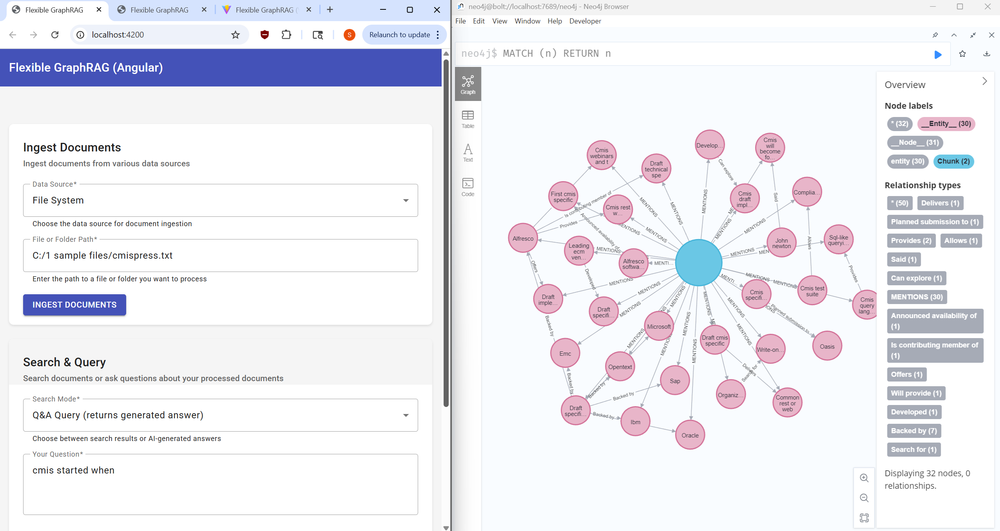
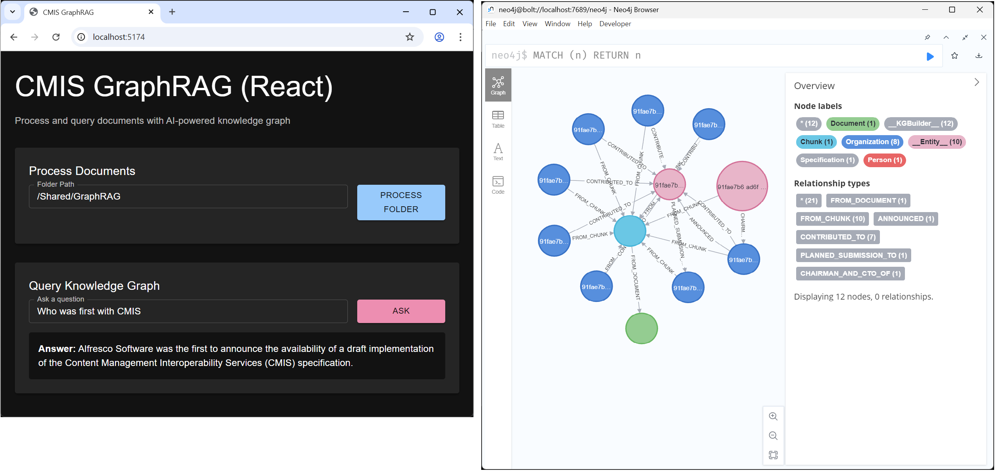
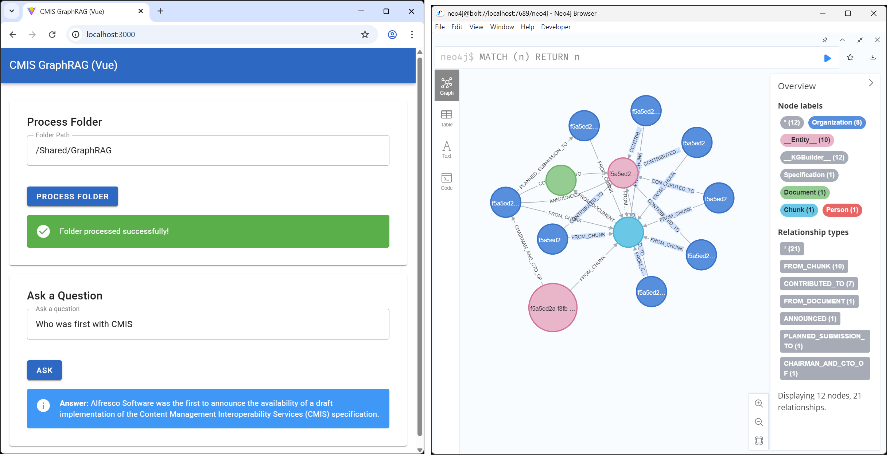

# Flexible GraphRAG with Angular, React, and Vue Frontends

This project provides simple Angular, React, and Vue user interfaces using TypeScript with a Python FastAPI backend based on the [cmis-graphrag-ui](https://github.com/stevereiner/cmis-graphrag-ui) project

These frontends provide for entering a folder path in a CMIS repository for processing. 
Processing uses the [neo4j-graphrag](https://github.com/neo4j/neo4j-graphrag-python) python package from Neo4j (which uses LLMs) to build knowledge graphs in Neo4j. 
The UI provides for entering text queries that are given to neo4j-graphrag for combined Graph / GraphRAG and Vector / RAG question answering using LLMs.

## Frontend Screenshots

| Angular UI | React UI | Vue UI |
|------------|----------|--------|
|  |  |  |

## Notes
   - **Supported file types**: PDF, DOCX, PPTX (via Docling), plus TXT and MD files
   - **Data sources**: File system (local files/folders), CMIS repositories, or Alfresco
   - Try with a folder with a few small documents initially.
   - Doesn't support replacing previous KG building if repeat the same document 
   (will get duplicate doc and chunk nodes, shouldn't duplicate entity and relationship nodes)
   - GraphRAG would be for a select set of docs needing more accuracy with answers to questions. 
   - Also would help if your organization wants to have a Schema to create knowledge graphs using your standard entity and relation terms (not used, but sample code in backend\neo4j_util.py)
   - Regular vector RAG and full text searching can still be used (or combined with GraphRAG)
   - If your running a local LLM (with Ollama) you should have a good Nvida card with large memory (4090,5090) and your system should have a large amount of memory. Then you can use a medium model. Otherwise use a small model. May want to use smaller models to save disk space. Can't use the large ones unless your GPU has a even larger amount of memory say a RTX Pro 6000 with 96 GB of memory on your server (llama-3.3-70b-instruct@q8_0: Benchmarks show that this model can run on the RTX PRO 6000, utilizing approximately 81GB of VRAM.) And your server would need 96 GB or recommended 192 GB of memory to run the LLM. It should be greater than or recommended double the amount of memory your GPU has.
   - If using OpenAI, you need a key and you may not want to send critical information.

## Prerequisites

### Required
- Python 3.10+ (supports 3.10, 3.11, 3.12, 3.13)
- UV package manager
- Node.js 16+
- npm or yarn
- Neo4j graph database
- Ollama or OpenAI with API key (for LLM processing)

### Optional (depending on data source)
- CMIS-compliant repository (e.g., Alfresco) - only if using CMIS data source
- Alfresco repository - only if using Alfresco data source
- File system data source requires no additional setup

## Setup

### Python Backend Setup

1. Navigate to the backend directory:
   ```bash
   cd flexible-graphrag
   ```

2. Create a virtual environment using UV and activate it:
   ```bash
   # From project root directory
   uv venv
   .\.venv\Scripts\Activate  # On Windows (works in both Command Prompt and PowerShell)
   # or
   source .venv/bin/activate  # on macOS/Linux
   ```

3. Install Python dependencies:
   ```bash
   # Navigate to flexible-graphrag directory and install requirements
   cd flexible-graphrag
   uv pip install -r requirements.txt
   ```

4. Create a `.env` file in the flexible-graphrag directory with your configuration:
   ```
   CMIS_URL=http://your-cmis-server/alfresco/api/-default-/public/cmis/versions/1.1/atom
   CMIS_USERNAME=your-username
   CMIS_PASSWORD=your-password
   NEO4J_URI=neo4j://localhost:7689
   NEO4J_USER=neo4j
   NEO4J_PASSWORD=your-neo4j-password
   USE_OPENAI=true  # Set to false to use Ollama
   OPENAI_API_KEY=your-openai-api-key  # If using OpenAI
   OPENAI_MODEL=gpt-4.1-mini  # If using OpenAI set OpenAI model
   LAMA_MODEL=llama3.1:8b  # If using Ollama set Ollama model
   ```

### Frontend Setup

**Important**: Development vs Production serving:

**Development Mode** (frontend and backend run separately):
- **Backend API**: http://localhost:8000 (FastAPI server only)
- **Angular Dev**: http://localhost:4200 (ng serve)
- **React Dev**: http://localhost:5173 (npm run dev)
- **Vue Dev**: http://localhost:5174 (npm run dev)

**Production Mode** (backend serves built frontend):
- **Everything**: http://localhost:8000 (FastAPI serves API + built frontend)
- Requires building frontend first: `ng build`, `npm run build`, etc.
- Backend automatically detects and serves the built frontend

Choose one of the following frontend options to work with:

#### React Frontend

1. Navigate to the React frontend directory:
   ```bash
   cd flexible-graphrag-ui/frontend-react
   ```

2. Install Node.js dependencies:
   ```bash
   npm install
   ```

3. Start the development server (uses Vite):
   ```bash
   npm run dev
   ```

The React frontend will be available at `http://localhost:5174`.

#### Angular Frontend

1. Navigate to the Angular frontend directory:
   ```bash
   cd flexible-graphrag-ui/frontend-angular
   ```

2. Install Node.js dependencies:
   ```bash
   npm install
   ```

3. Start the development server (uses Angular CLI):
   ```bash
   npm start
   ```

The Angular frontend will be available at `http://localhost:4200`.

#### Vue Frontend

1. Navigate to the Vue frontend directory:
   ```bash
   cd flexible-graphrag-ui/frontend-vue
   ```

2. Install Node.js dependencies:
   ```bash
   npm install
   ```

3. Start the development server (uses Vite):
   ```bash
   npm run dev
   ```

The Vue frontend will be available at `http://localhost:3000`.

## Running the Application

### Start the Python Backend

From the project root directory:

```bash
cd flexible-graphrag
uvicorn main:app --reload
```

The backend will be available at `http://localhost:8000`.

### Start Your Preferred Frontend

Follow the instructions in the Frontend Setup section for your chosen frontend framework.

### Production Build and Deployment

For production, build the frontend and let the backend serve it:

#### Build Frontend
```bash
# Angular
cd flexible-graphrag-ui/frontend-angular
ng build

# React  
cd flexible-graphrag-ui/frontend-react
npm run build

# Vue
cd flexible-graphrag-ui/frontend-vue
npm run build
```

#### Start Production Server
```bash
cd flexible-graphrag
uvicorn main:app --host 0.0.0.0 --port 8000
```

The backend will:
1. Check for all built frontends and serve each at its own route
2. Serve all available frontends simultaneously at different URLs
3. Serve API endpoints at the same port under `/api/*`
4. Provide a root endpoint listing all available interfaces

**Production URLs (all on port 8000)**:
- **Root Info**: http://localhost:8000/ (lists all available frontends and API)
- **Angular UI**: http://localhost:8000/angular/ (if built)
- **React UI**: http://localhost:8000/react/ (if built)
- **Vue UI**: http://localhost:8000/vue/ (if built)
- **API Endpoints**: http://localhost:8000/api/* (ingest, search, query, status, etc.)
- **API Info**: http://localhost:8000/api/info (lists all endpoints and frontends)
- **Health Check**: http://localhost:8000/api/health

**Build any or all frontends**:
- You can build one, two, or all three frontends
- Each built frontend will be available at its own route
- Users can choose which UI they prefer to use

## Full-Stack Debugging

The project includes a `sample-launch.json` file with VS Code debugging configurations for all three frontend options and the backend. Copy this file to `.vscode/launch.json` to use these configurations.

Key debugging configurations include:

1. **Full Stack with React and Python**: Debug both the React frontend and Python backend simultaneously
2. **Full Stack with Angular and Python**: Debug both the Angular frontend and Python backend simultaneously
3. **Full Stack with Vue and Python**: Debug both the Vue frontend and Python backend simultaneously
4. Note when ending debugging, you will need to stop the Python backend and the frontend separately.

Each configuration sets up the appropriate ports, source maps, and debugging tools for a seamless development experience. You may need to adjust the ports and paths in the `launch.json` file to match your specific setup.

## Usage

### 1. Ingest Documents

The system supports three data sources. Choose your data source in the web interface:

#### File System (Default)
- **Select**: "File System" from the data source dropdown
- **Enter**: Path to a file or folder (e.g., `C:\Documents\reports` or `/home/user/docs/report.pdf`)
- **Supported files**: PDF, DOCX, PPTX, TXT, MD
- **Click**: "Ingest Documents" to process

#### CMIS Repository
- **Select**: "CMIS Repository" from the data source dropdown
- **Configure**: 
  - CMIS Repository URL (e.g., `http://localhost:8080/alfresco/api/-default-/public/cmis/versions/1.1/atom`)
  - Username and password
  - Folder path (e.g., `/Sites/example/documentLibrary`)
- **Click**: "Ingest Documents" to process

#### Alfresco Repository
- **Select**: "Alfresco Repository" from the data source dropdown
- **Configure**:
  - Alfresco Base URL (e.g., `http://localhost:8080/alfresco`)
  - Username and password
  - Path (e.g., `/Sites/example/documentLibrary`)
- **Click**: "Ingest Documents" to process

The system uses:
- **Docling** for advanced PDF/DOCX conversion to markdown
- **LlamaIndex** for vector indexing and knowledge graph creation
- **Neo4j** for storing vectors and knowledge graphs
- **BM25** for full-text search (no additional search engine required)

### 2. Search and Query

The system offers two distinct modes for retrieving information:

#### Hybrid Search (Document Retrieval)
- **Purpose**: Find and rank the most relevant document excerpts
- **Use when**: You want to see actual source material and multiple perspectives
- **Select**: "Hybrid Search" mode in the web interface
- **Enter**: Search terms or phrases (e.g., "machine learning algorithms", "financial projections")
- **Results**: Ranked list of document excerpts with:
  - Relevance scores
  - Source file names and types
  - Exact text snippets from documents
- **Best for**: Research, fact-checking, finding specific information across documents

#### Q&A Query (AI-Generated Answers)
- **Purpose**: Get synthesized answers to natural language questions
- **Use when**: You want a comprehensive answer combining information from multiple sources
- **Select**: "Q&A Query" mode in the web interface  
- **Enter**: Natural language questions (e.g., "What are the main findings in the research papers?", "How do the quarterly results compare?")
- **Results**: AI-generated narrative answers that:
  - Synthesize information from multiple documents
  - Provide coherent, contextual responses
  - Reference the underlying source material
- **Best for**: Summarization, analysis, getting overviews of complex topics

#### Technical Implementation
The hybrid search combines three retrieval methods:
- **Vector similarity** search using embeddings for semantic matching
- **BM25 full-text** search for exact keyword matching
- **Graph traversal** for entity and relationship discovery from knowledge graphs

Both modes use the same underlying retrieval but process results differently:
- **Search**: Returns raw ranked documents for user review
- **Q&A**: Feeds documents to LLM for answer generation
   
3. **Testing Cleanup**
   - Between tests you can delete detach nodes and relations in Neo4j, drop only vector_index_openai, vector_index_ollama and __entity__id indexes 
   - Use on a test Neo4j database no one else is using
   - See https://github.com/stevereiner/cmis-graphrag at the end for cleanup commands you can enter in the neo4j console 

## Project Structure

- `/flexible-graphrag`: Python FastAPI backend with LlamaIndex
  - `main.py`: FastAPI REST API server (clean, no MCP)
  - `backend.py`: Shared business logic core used by both API and MCP
  - `config.py`: Configurable settings for data sources, databases, and LLM providers
  - `hybrid_system.py`: Main hybrid search system using LlamaIndex
  - `document_processor.py`: Document processing with Docling integration
  - `factories.py`: Factory classes for LLM and database creation
  - `sources.py`: Data source connectors (filesystem, CMIS, Alfresco)
  - `requirements.txt`: FastAPI and LlamaIndex dependencies
  - `start.py`: Startup script for uvicorn
  - `install.py`: Installation helper script

- `/flexible-graphrag-mcp`: Standalone FastMCP server
  - `fastmcp-server.py`: Proper remote MCP server using shared backend.py
  - `main.py`: Alternative HTTP-based MCP client (calls REST API)
  - `requirements.txt`: FastMCP and shared backend dependencies
  - `README.md`: MCP server setup instructions
  - **No HTTP overhead**: Calls backend.py directly through Python imports

- `/flexible-graphrag-ui`: Frontend applications
  - `/frontend-react`: React + TypeScript frontend (built with Vite)
    - `/src`: Source code
    - `vite.config.ts`: Vite configuration
    - `tsconfig.json`: TypeScript configuration
    - `package.json`: Node.js dependencies and scripts

  - `/frontend-angular`: Angular + TypeScript frontend (built with Angular CLI)
    - `/src`: Source code
    - `angular.json`: Angular configuration
    - `tsconfig.json`: TypeScript configuration
    - `package.json`: Node.js dependencies and scripts

  - `/frontend-vue`: Vue + TypeScript frontend (built with Vite)
    - `/src`: Source code
    - `vite.config.ts`: Vite configuration
    - `tsconfig.json`: TypeScript configuration
    - `package.json`: Node.js dependencies and scripts

## License

This project is licensed under the terms of the Apache License 2.0. See the [LICENSE](LICENSE) file for details.
