# Flexible GraphRAG

**Flexible GraphRAG** is a platform supporting document processing, knowledge graph auto-building, RAG and GraphRAG setup, hybrid search (fulltext, vector, graph) and AI Q&A query capabilities.

## What It Is

A configurable hybrid search system that optionally combines vector similarity search, full-text search, and knowledge graph GraphRAG on document processed from multiple data sources (filesystem, Alfresco, CMIS, etc.). Built with LlamaIndex which provides abstractions for allowing multiple vector, search graph databases, LLMs to be supported. It has both a FastAPI backend with REST endpoints and a Model Context Protocol (MCP) server for MCP clients like Claude Desktop, etc. Also has simple Angular, React, and Vue UI clients (which use the REST APIs of the FastAPI backend) for using interacting with the system.


- **Hybrid Search**: Combines vector embeddings, BM25 full-text search, and graph traversal for comprehensive document retrieval
- **Knowledge Graph GraphRAG**: Extracts entities and relationships from documents to create graphs in graph databases for graph-based reasoning  
- **Configurable Architecture**: LlamaIndex provides abstractions for vector databases, graph databases, search engines, and LLM providers
- **Multi-Source Ingestion**: Processes documents from filesystems, CMIS repositories, and Alfresco systems
- **FastAPI Server with REST API**: FastAPI server with REST API for document ingesting, hybrid search, and AI Q&A query
- **MCP Server**: MCP server that provides MCP Clients like Claude Desktop, etc. tools for document and text ingesting, hybrid search and AI Q&A query.
- **UI Clients**: Angular, React, and Vue UI clients support choosing the data source (filesystem, Alfresco, CMIS, etc.), ingesting documents, performing hybrid searches and AI Q&A Queries.
- **Docker Deployment Flexibility**: Supports both standalone and Docker deployment modes. Docker infrastructure provides modular database selection via docker-compose includes - vector, graph, and search databases can be included or excluded with a single comment. Choose between hybrid deployment (databases in Docker, backend and UIs standalone) or full containerization.

## Frontend Screenshots

### Angular Frontend - Tabbed Interface

<details>
<summary>Click to view Angular UI screenshots</summary>

| Sources Tab | Processing Tab | Search Tab | Chat Tab |
|-------------|----------------|------------|----------|
| [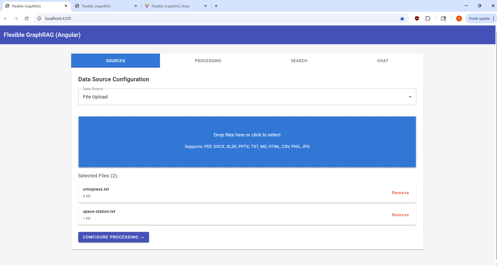](./screen-shots/angular-sources.png) | [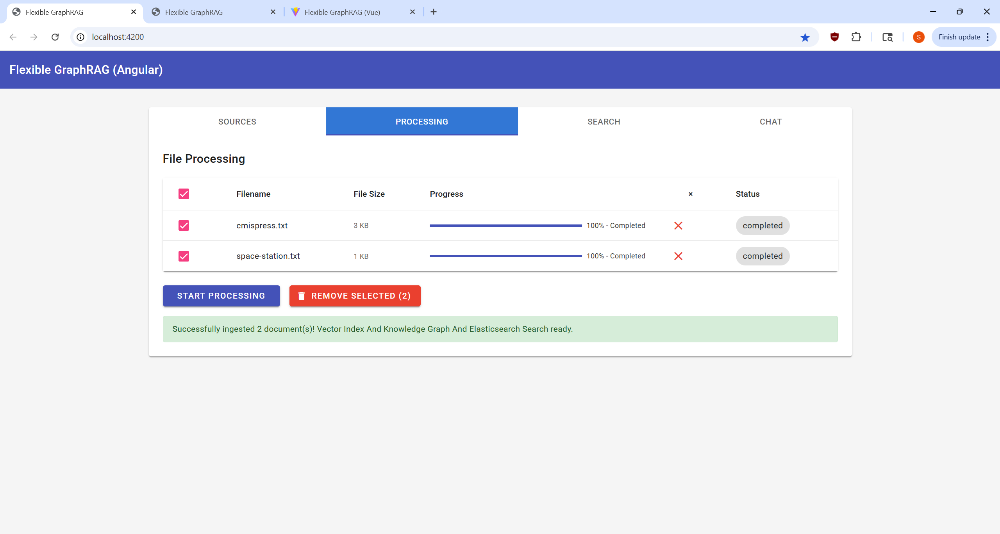](./screen-shots/angular-processing.png) | [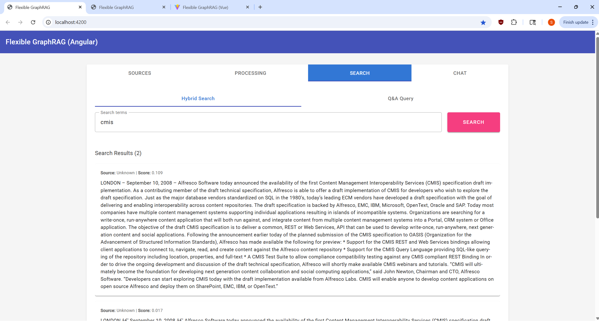](./screen-shots/angular-search.png) | [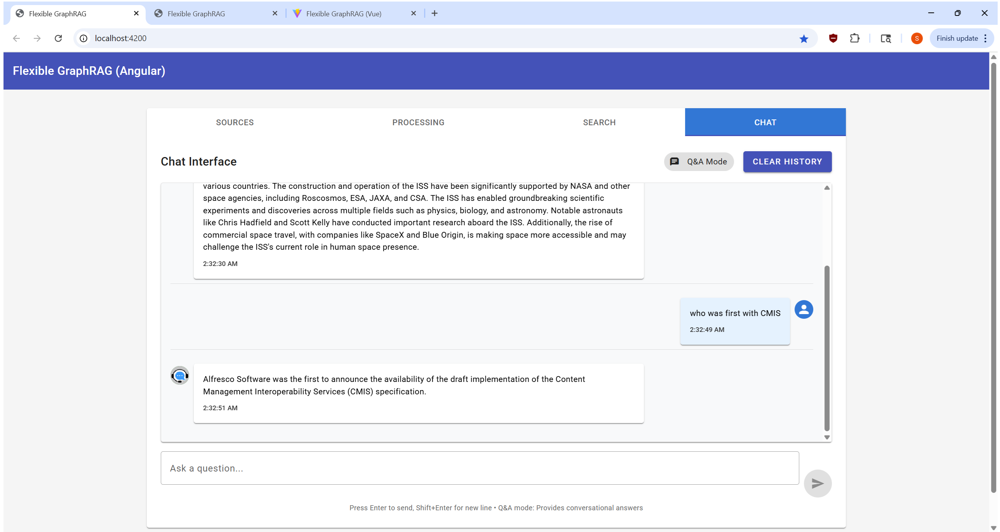](./screen-shots/angular-chat.png) |

</details>

### React Frontend - Tabbed Interface

<details open>
<summary>Click to view React UI screenshots</summary>

| Sources Tab | Processing Tab | Search Tab | Chat Tab |
|-------------|----------------|------------|----------|
| [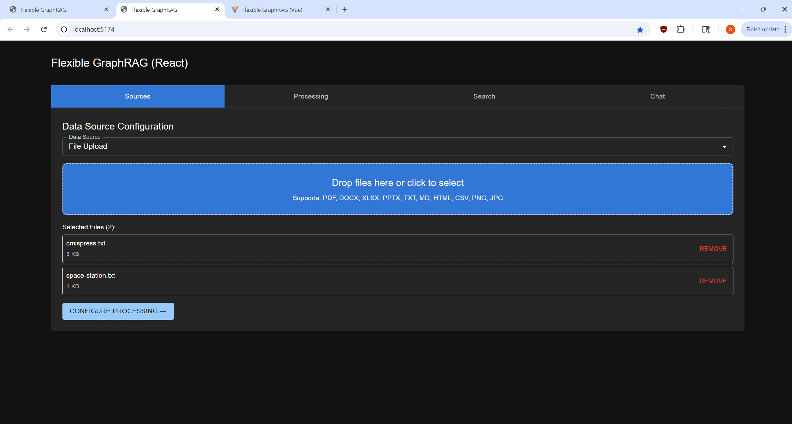](./screen-shots/react-sources.png) | [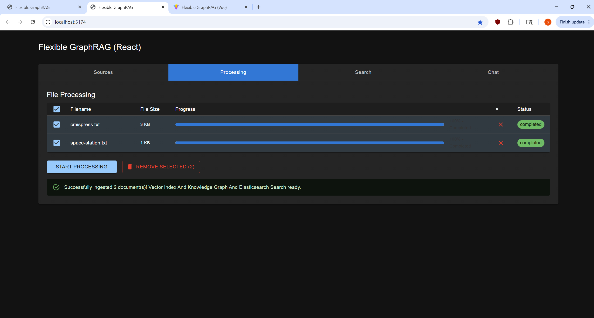](./screen-shots/react-processing.png) | [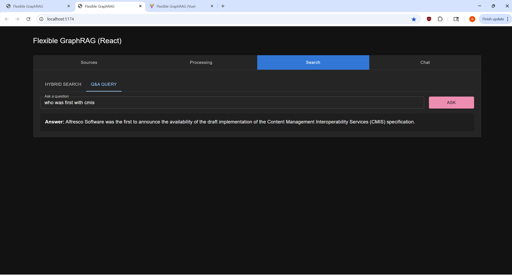](./screen-shots/react-search.png) | [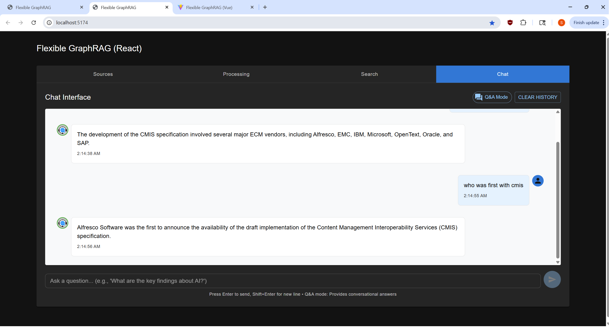](./screen-shots/react-chat.png) |

</details>

### Vue Frontend - Tabbed Interface

<details>
<summary>Click to view Vue UI screenshots</summary>

| Sources Tab | Processing Tab | Search Tab | Chat Tab |
|-------------|----------------|------------|----------|
| [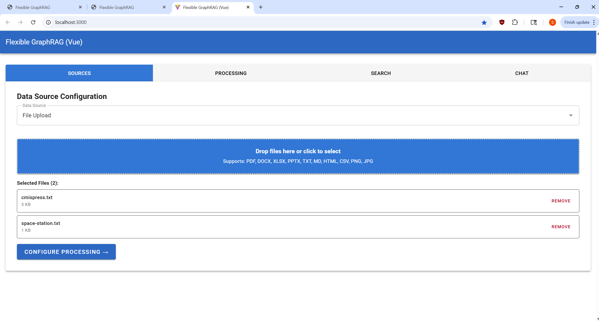](./screen-shots/vue-sources.png) | [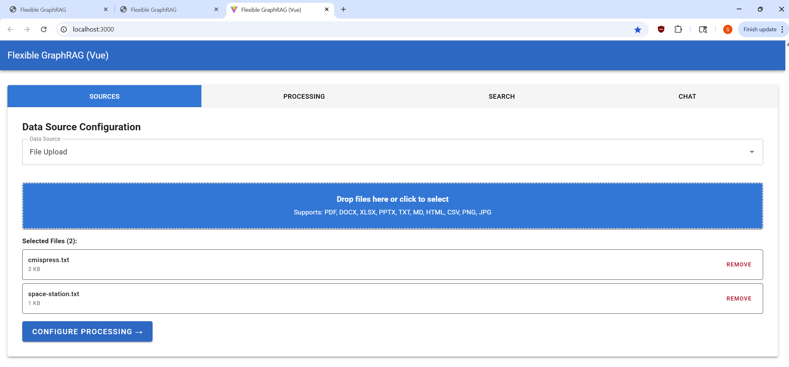](./screen-shots/vue-processing.png) | [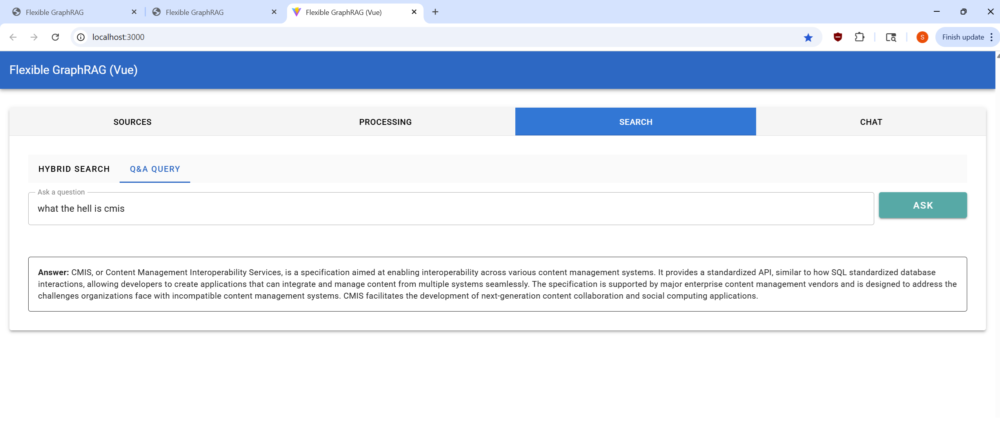](./screen-shots/vue-search.png) | [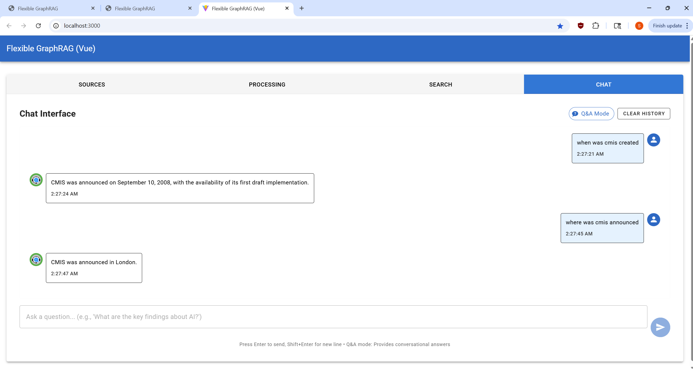](./screen-shots/vue-chat.png) |

</details>

## System Components

### FastAPI Backend (`/flexible-graphrag`)
- **REST API Server**: Provides endpoints for document ingestion, search, and Q&A
- **Hybrid Search Engine**: Combines vector similarity, BM25, and graph traversal
- **Document Processing**: Advanced document conversion with Docling integration
- **Configurable Architecture**: Environment-based configuration for all components
- **Async Processing**: Background task processing with real-time progress updates

### MCP Server (`/flexible-graphrag-mcp`)  
- **Claude Desktop Integration**: Model Context Protocol server for AI assistant workflows
- **Dual Transport**: HTTP mode for debugging, stdio mode for Claude Desktop
- **Tool Suite**: 9 specialized tools for document processing, search, and system management
- **Multiple Installation**: pipx system installation or uvx no-install execution

### UI Clients (`/flexible-graphrag-ui`)
- **Angular Frontend**: Material Design with TypeScript
- **React Frontend**: Modern React with Vite and TypeScript  
- **Vue Frontend**: Vue 3 Composition API with Vuetify and TypeScript
- **Unified Features**: All clients support async processing, progress tracking, and cancellation

### Docker Infrastructure (`/docker`)
- **Modular Database Selection**: Include/exclude vector, graph, and search databases with single-line comments
- **Flexible Deployment**: Hybrid mode (databases in Docker, apps standalone) or full containerization
- **NGINX Reverse Proxy**: Unified access to all services with proper routing
- **Database Dashboards**: Integrated web interfaces for Kibana (Elasticsearch), OpenSearch Dashboards, Neo4j Browser, and Kuzu Explorer

## Supported File Formats

The system processes **15+ document formats** through intelligent routing between Docling (advanced processing) and direct text handling:

### Document Formats (Docling Processing)
- **PDF**: `.pdf` - Advanced layout analysis, table extraction, formula recognition
- **Microsoft Office**: `.docx`, `.xlsx`, `.pptx` - Full structure preservation and content extraction
- **Web Formats**: `.html`, `.htm`, `.xhtml` - Markup structure analysis
- **Data Formats**: `.csv`, `.xml`, `.json` - Structured data processing
- **Documentation**: `.asciidoc`, `.adoc` - Technical documentation with markup preservation

### Image Formats (Docling OCR)
- **Standard Images**: `.png`, `.jpg`, `.jpeg` - OCR text extraction
- **Professional Images**: `.tiff`, `.tif`, `.bmp`, `.webp` - Layout-aware OCR processing

### Text Formats (Direct Processing)
- **Plain Text**: `.txt` - Direct ingestion for optimal chunking
- **Markdown**: `.md`, `.markdown` - Preserved formatting for technical documents

### Processing Intelligence
- **Adaptive Output**: Tables convert to markdown, text content to plain text for optimal entity extraction
- **Format Detection**: Automatic routing based on file extension and content analysis
- **Fallback Handling**: Graceful degradation for unsupported formats

## Vector, Graph, and Search Databases & LLM Configuration

### ⚠️ Vector Dimension Compatibility

**CRITICAL**: When switching between different embedding models (e.g., OpenAI ↔ Ollama), you **MUST delete existing vector indexes** due to dimension incompatibility:

- **OpenAI**: 1536 dimensions (text-embedding-3-small) or 3072 dimensions (text-embedding-3-large)
- **Ollama**: 1024 dimensions (mxbai-embed-large) or 768 dimensions (nomic-embed-text)
- **Azure OpenAI**: Same as OpenAI (1536 or 3072 dimensions)

**See [VECTOR-DIMENSIONS.md](VECTOR-DIMENSIONS.md) for detailed cleanup instructions for each database.**

### Vector Databases 
Current configuration supports (via LlamaIndex abstractions, can be extended to cover others that LlamaIndex supports):
- **Neo4j Vector**: Native vector storage in Neo4j with APOC support
  - Dashboard: Neo4j Browser (http://localhost:7474) for Cypher queries and graph visualization
- **Qdrant**: Dedicated vector database with advanced filtering
  - Dashboard: Qdrant Web UI (http://localhost:6333/dashboard) for collection management
- **Elasticsearch**: Full-text and vector search capabilities
  - Dashboard: Kibana (http://localhost:5601) for index management and data visualization
- **OpenSearch**: Open-source Elasticsearch alternative
  - Dashboard: OpenSearch Dashboards (http://localhost:5601) for cluster and index management

### Graph Databases  
Current configuration supports (via LlamaIndex abstractions, can be extended to cover others that LlamaIndex supports):
- **Neo4j Property Graph**: Primary knowledge graph storage with Cypher querying
  - Dashboard: Neo4j Browser (http://localhost:7474) for graph exploration and query execution
- **Kuzu**: Embedded graph database built for query speed and scalability, optimized for handling complex analytical workloads on very large graph databases. Supports the property graph data model and the Cypher query language
  - Dashboard: Kuzu Explorer (http://localhost:8002) for graph visualization and Cypher queries

### Search Databases (Engines)
- **BM25 (Built-in)**: Local file-based BM25 full-text search with TF-IDF ranking. Ideal for development, small datasets, or scenarios when don't need all the features and administration and monitoring support.
- **Elasticsearch**: Enterprise search engine with vector similarity, BM25 text search, advanced analyzers, faceted search, and real-time analytics. Ideal for production workloads requiring sophisticated text processing and search relevance tuning
  - Dashboard: Kibana (http://localhost:5601) for search analytics, index management, and query debugging
- **OpenSearch**: AWS-led open-source fork of Elasticsearch with native vector search, hybrid scoring (vector + BM25), k-NN algorithms, and built-in machine learning features. Offers cost-effective alternative with strong community support and seamless hybrid search capabilities
  - Dashboard: OpenSearch Dashboards (http://localhost:5601) for cluster monitoring and search pipeline management

### LLM Providers
- **OpenAI**: GPT models with configurable endpoints
- **Ollama**: Local LLM deployment for privacy and control
- **Azure OpenAI**: Enterprise OpenAI integration
- **Anthropic**: Claude models for complex reasoning
- **Google Gemini**: Google's latest language models

#### ⚠️ LLM Performance Recommendations

**General Performance with LlamaIndex: OpenAI vs Ollama**

Based on testing with OpenAI GPT-4o-mini and Ollama models (llama3.1:8b, llama3.2:latest, gpt-oss:20b), **OpenAI consistently outperforms Ollama models** in LlamaIndex operations:

- **Document Processing**: OpenAI models process documents significantly faster
- **Entity Extraction**: OpenAI provides much quicker entity and relationship identification  
- **Query Response**: Search and Q&A queries complete faster with OpenAI
- **Resource Efficiency**: Better performance even on high-end hardware

**Kuzu + Ollama: Strongly Avoid This Combination**

**When using Kuzu as your graph database, very strongly recommend OpenAI over Ollama models** - the performance difference is dramatic even on powerful hardware (tested on 4090 Nvidia GPU, AMD 5950x 16-core CPU, 64GB RAM):

- **Knowledge Graph Construction**: Ollama models are extremely slow for entity/relationship extraction with Kuzu
- **Large Model Impact**: Even larger Ollama models (gpt-oss:20b) remain considerably slower than OpenAI GPT-4o-mini
- **Small Document Problem**: Performance issues persist even with small documents
- **Search Degradation**: Graph-enhanced search queries are noticeably slower
- **Development Impact**: Slow feedback loops significantly impact development workflow

**Recommendation**: Use OpenAI for Kuzu deployments, reserve Ollama for Neo4j-based setups where performance is more acceptable.

### RAG without GraphRAG

The system can be configured for **RAG (Retrieval-Augmented Generation) without also GraphRAG** This simpler deployment also only do setting up vectors for RAG. It will skip setup for GraphRAG: no auto-building Graphs / Knowledge Graphs in a Graph Database. The processing time will be faster. You can still do Hybrid Search (full text search + vectors for RAG). You can also still do AI Q&A Queries or Chats.  

#### Configuration Steps

To enable RAG-only mode, configure these environment variables in your `.env` file:

1. **Configure Search Database** (choose one):
   ```bash
   # Option 1: Elasticsearch
   SEARCH_DB=elasticsearch
   SEARCH_DB_CONFIG={"index_name": "documents", "host": "localhost", "port": 9200}
   
   # Option 2: OpenSearch  
   SEARCH_DB=opensearch
   SEARCH_DB_CONFIG={"index_name": "documents", "host": "localhost", "port": 9201}
   
   # Option 3: Built-in BM25
   SEARCH_DB=bm25
   SEARCH_DB_CONFIG={"persist_dir": "./bm25_index"}
   ```

2. **Configure Vector Database** (choose one):
   ```bash
   # Option 1: Neo4j (vector-only)
   VECTOR_DB=neo4j
   VECTOR_DB_CONFIG={"uri": "bolt://localhost:7687", "username": "neo4j", "password": "password"}
   
   # Option 2: Qdrant
   VECTOR_DB=qdrant  
   VECTOR_DB_CONFIG={"host": "localhost", "port": 6333, "collection_name": "documents"}
   
   # Option 3: Elasticsearch (dual-purpose)
   VECTOR_DB=elasticsearch
   VECTOR_DB_CONFIG={"index_name": "vectors", "host": "localhost", "port": 9200}
   
   # Option 4: OpenSearch (dual-purpose)
   VECTOR_DB=opensearch
   VECTOR_DB_CONFIG={"index_name": "vectors", "host": "localhost", "port": 9201}
   ```

3. **Disable Knowledge Graph**:
   ```bash
   GRAPH_DB=none
   ENABLE_KNOWLEDGE_GRAPH=false
   ```


## MCP Tools for MCP Clients like Claude Desktop, etc.

The MCP server provides 9 specialized tools for document intelligence workflows:

| Tool | Purpose | Usage |
|------|---------|-------|
| `get_system_status()` | System health and configuration | Verify setup and database connections |
| `ingest_documents(data_source, paths)` | Bulk document processing | Process files/folders from filesystem, CMIS, Alfresco |
| `ingest_text(content, source_name)` | Custom text analysis | Analyze specific text content |
| `search_documents(query, top_k)` | Hybrid document retrieval | Find relevant document excerpts |
| `query_documents(query, top_k)` | AI-powered Q&A | Generate answers from document corpus |
| `test_with_sample()` | System verification | Quick test with sample content |
| `check_processing_status(id)` | Async operation monitoring | Track long-running ingestion tasks |
| `get_python_info()` | Environment diagnostics | Debug Python environment issues |
| `health_check()` | Backend connectivity | Verify API server connection |

### Client Support
- **Claude Desktop and other MCP clients**: Native MCP integration with stdio transport
- **MCP Inspector**: HTTP transport for debugging and development
- **Multiple Installation**: pipx (system-wide) or uvx (no-install) options

## Prerequisites

### Required
- Python 3.10+ (supports 3.10, 3.11, 3.12, 3.13)
- UV package manager
- Node.js 16+
- npm or yarn
- Neo4j graph database
- Ollama or OpenAI with API key (for LLM processing)

### Optional (depending on data source)
- CMIS-compliant repository (e.g., Alfresco) - only if using CMIS data source
- Alfresco repository - only if using Alfresco data source
- File system data source requires no additional setup

## Setup

### 🐳 Docker Deployment

Docker deployment offers two main approaches:

#### Option A: Databases in Docker, App Standalone (Hybrid)
**Best for**: Development, external content management systems, flexible deployment

```bash
# Deploy only databases you need
docker-compose -f docker/docker-compose.yaml up -d

# Comment out services you don't need in docker-compose.yaml:
# - includes/neo4j.yaml          # Comment out if using your own Neo4j
# - includes/kuzu.yaml           # Comment out if not using Kuzu
# - includes/qdrant.yaml         # Comment out if using Neo4j, Elasticsearch, or OpenSearch for vectors  
# - includes/elasticsearch.yaml  # Comment out if not using Elasticsearch
# - includes/elasticsearch-dev.yaml  # Comment out if not using Elasticsearch
# - includes/kibana.yaml         # Comment out if not using Elasticsearch
# - includes/opensearch.yaml     # Comment out if not using
# - includes/alfresco.yaml       # Comment out if you want to use your own Alfresco install
# - includes/app-stack.yaml      # Remove comment if you want backend and UI in Docker
# - includes/proxy.yaml          # Remove comment if you want backend and UI in Docker
#   (Note: app-stack.yaml has env config in it to customize for vector, graph, search, LLM using)

# Run backend and UI clients outside Docker
cd flexible-graphrag
uv run start.py
```

**Use cases:**
- ✅ **File Upload**: Direct file upload through web interface
- ✅ **External CMIS/Alfresco**: Connect to existing content management systems
- ✅ **Development**: Easy debugging and hot-reloading
- ✅ **Mixed environments**: Databases in containers, apps on host

#### Option B: Full Stack in Docker (Complete)
**Best for**: Production deployment, isolated environments, containerized content sources

```bash
# Deploy everything including backend and UIs
docker-compose -f docker/docker-compose.yaml up -d
```

**Features:**
- ✅ All databases pre-configured (Neo4j, Kuzu, Qdrant, Elasticsearch, OpenSearch, Alfresco)
- ✅ Backend + 3 UI clients (Angular, React, Vue) in containers
- ✅ NGINX reverse proxy with unified URLs
- ✅ Persistent data volumes
- ✅ Internal container networking

**Service URLs after startup:**
- **Angular UI**: http://localhost:8070/ui/angular/
- **React UI**: http://localhost:8070/ui/react/  
- **Vue UI**: http://localhost:8070/ui/vue/
- **Backend API**: http://localhost:8070/api/
- **Neo4j Browser**: http://localhost:7474/
- **Kuzu Explorer**: http://localhost:8002/

**Data Source Workflow:**
- ✅ **File Upload**: Upload files directly through the web interface (drag & drop or file selection dialog on click)
- ✅ **Alfresco/CMIS**: Connect to existing Alfresco systems or CMIS repositories

#### Configuration

1. **Modular deployment**: Comment out services you don't need in `docker/docker-compose.yaml`

2. **Environment configuration** (for app-stack deployment): 
   - Environment variables are configured directly in `docker/includes/app-stack.yaml`
   - Database connections use `host.docker.internal` for container-to-container communication
   - Default configuration includes OpenAI/Ollama LLM settings and database connections

See [docker/README.md](./docker/README.md) for detailed Docker configuration.

### 🔧 Local Development Setup

#### Environment Configuration

**Create environment file** (cross-platform):
```bash
# Linux/macOS
cp flexible-graphrag/env-sample.txt flexible-graphrag/.env

# Windows Command Prompt  
copy flexible-graphrag\env-sample.txt flexible-graphrag\.env

# Windows PowerShell
Copy-Item flexible-graphrag\env-sample.txt flexible-graphrag\.env
```
Edit `.env` with your database credentials and API keys.

### Python Backend Setup

1. Navigate to the backend directory:
   ```bash
   cd project-directory/flexible-graphrag
   ```

2. Create a virtual environment using UV and activate it:
   ```bash
   # From project root directory
   uv venv
   .\.venv\Scripts\Activate  # On Windows (works in both Command Prompt and PowerShell)
   # or
   source .venv/bin/activate  # on macOS/Linux
   ```

3. Install Python dependencies:
   ```bash
   # Navigate to flexible-graphrag directory and install requirements
   cd flexible-graphrag
   uv pip install -r requirements.txt
   ```

4. Create a `.env` file by copying the sample and customizing:
   ```bash
   # Copy sample environment file (use appropriate command for your platform)
   cp env-sample.txt .env  # Linux/macOS
   copy env-sample.txt .env  # Windows
   ```
   
   Edit `.env` with your specific configuration. See [docs/ENVIRONMENT-CONFIGURATION.md](docs/ENVIRONMENT-CONFIGURATION.md) for detailed setup guide.

### Frontend Setup

**Production Mode** (backend does not serve frontend):
- **Backend API**: http://localhost:8000 (FastAPI server only)
- **Frontend deployment**: Separate deployment (nginx, Apache, static hosting, etc.)
- Both standalone and Docker frontends point to backend at localhost:8000

**Development Mode** (frontend and backend run separately):
- **Backend API**: http://localhost:8000 (FastAPI server only)
- **Angular Dev**: http://localhost:4200 (ng serve)
- **React Dev**: http://localhost:5173 (npm run dev)  
- **Vue Dev**: http://localhost:5174 (npm run dev)

Choose one of the following frontend options to work with:

#### React Frontend

1. Navigate to the React frontend directory:
   ```bash
   cd flexible-graphrag-ui/frontend-react
   ```

2. Install Node.js dependencies:
   ```bash
   npm install
   ```

3. Start the development server (uses Vite):
   ```bash
   npm run dev
   ```

The React frontend will be available at `http://localhost:5174`.

#### Angular Frontend

1. Navigate to the Angular frontend directory:
   ```bash
   cd flexible-graphrag-ui/frontend-angular
   ```

2. Install Node.js dependencies:
   ```bash
   npm install
   ```

3. Start the development server (uses Angular CLI):
   ```bash
   npm start
   ```

The Angular frontend will be available at `http://localhost:4200`.

**Note**: If `ng build` gives budget errors, use `npm start` for development instead.

#### Vue Frontend

1. Navigate to the Vue frontend directory:
   ```bash
   cd flexible-graphrag-ui/frontend-vue
   ```

2. Install Node.js dependencies:
   ```bash
   npm install
   ```

3. Start the development server (uses Vite):
   ```bash
   npm run dev
   ```

The Vue frontend will be available at `http://localhost:3000`.

## Running the Application

### Start the Python Backend

From the project root directory:

```bash
cd flexible-graphrag
uv run start.py
```

The backend will be available at `http://localhost:8000`.

### Start Your Preferred Frontend

Follow the instructions in the Frontend Setup section for your chosen frontend framework.

### Frontend Deployment

#### Build Frontend
```bash
# Angular (may have budget warnings - safe to ignore for development)
cd flexible-graphrag-ui/frontend-angular
ng build

# React  
cd flexible-graphrag-ui/frontend-react
npm run build

# Vue
cd flexible-graphrag-ui/frontend-vue
npm run build
```

**Angular Build Notes**:
- Budget warnings are common in Angular and usually safe to ignore for development
- For production, consider optimizing bundle sizes or adjusting budget limits in `angular.json`
- Development mode: Use `npm start` to avoid build issues

#### Start Production Server
```bash
cd flexible-graphrag
uv run start.py
```

The backend provides:
- API endpoints under `/api/*`
- Independent operation focused on data processing and search
- Clean separation from frontend serving concerns

**Backend API Endpoints**:
- **API Base**: http://localhost:8000/api/
- **API Endpoints**: `/api/ingest`, `/api/search`, `/api/query`, `/api/status`, etc.
- **Health Check**: http://localhost:8000/api/health

**Frontend Deployment**:
- **Manual Deployment**: Deploy frontends independently using your preferred method (nginx, Apache, static hosting, etc.)
- **Frontend Configuration**: Both standalone and Docker frontends point to backend at `http://localhost:8000/api/`
- Each frontend can be built and deployed separately based on your needs

## Full-Stack Debugging

The project includes a `sample-launch.json` file with VS Code debugging configurations for all three frontend options and the backend. Copy this file to `.vscode/launch.json` to use these configurations.

Key debugging configurations include:

1. **Full Stack with React and Python**: Debug both the React frontend and Python backend simultaneously
2. **Full Stack with Angular and Python**: Debug both the Angular frontend and Python backend simultaneously
3. **Full Stack with Vue and Python**: Debug both the Vue frontend and Python backend simultaneously
4. Note when ending debugging, you will need to stop the Python backend and the frontend separately.

Each configuration sets up the appropriate ports, source maps, and debugging tools for a seamless development experience. You may need to adjust the ports and paths in the `launch.json` file to match your specific setup.

## Usage

The system provides a tabbed interface for document processing and querying. Follow these steps in order:

### 1. Sources Tab

Configure your data source and select files for processing:

#### File Upload Data Source
- **Select**: "File Upload" from the data source dropdown
- **Add Files**: 
  - **Drag & Drop**: Drag files directly onto the upload area
  - **Click to Select**: Click the upload area to open file selection dialog (supports multi-select)
  - **Note**: If you drag & drop new files after selecting via dialog, only the dragged files will be used
- **Supported Formats**: PDF, DOCX, XLSX, PPTX, TXT, MD, HTML, CSV, PNG, JPG, and more
- **Next Step**: Click "CONFIGURE PROCESSING →" to proceed to Processing tab

#### Alfresco Repository
- **Select**: "Alfresco Repository" from the data source dropdown
- **Configure**:
  - Alfresco Base URL (e.g., `http://localhost:8080/alfresco`)
  - Username and password
  - Path (e.g., `/Sites/example/documentLibrary`)
- **Next Step**: Click "CONFIGURE PROCESSING →" to proceed to Processing tab

#### CMIS Repository
- **Select**: "CMIS Repository" from the data source dropdown
- **Configure**: 
  - CMIS Repository URL (e.g., `http://localhost:8080/alfresco/api/-default-/public/cmis/versions/1.1/atom`)
  - Username and password
  - Folder path (e.g., `/Sites/example/documentLibrary`)
- **Next Step**: Click "CONFIGURE PROCESSING →" to proceed to Processing tab

### 2. Processing Tab

Process your selected documents and monitor progress:

- **Start Processing**: Click "START PROCESSING" to begin document ingestion
- **Monitor Progress**: View real-time progress bars for each file
- **File Management**: 
  - Use checkboxes to select files
  - Click "REMOVE SELECTED (N)" to remove selected files from the list
  - **Note**: This removes files from the processing queue, not from your system
- **Processing Pipeline**: Documents are processed through Docling conversion, vector indexing, and knowledge graph creation

### 3. Search Tab

Perform searches on your processed documents:

#### Hybrid Search
- **Purpose**: Find and rank the most relevant document excerpts
- **Usage**: Enter search terms or phrases (e.g., "machine learning algorithms", "financial projections")
- **Action**: Click "SEARCH" button
- **Results**: Ranked list of document excerpts with relevance scores and source information
- **Best for**: Research, fact-checking, finding specific information across documents

#### Q&A Query
- **Purpose**: Get AI-generated answers to natural language questions
- **Usage**: Enter natural language questions (e.g., "What are the main findings in the research papers?")
- **Action**: Click "ASK" button
- **Results**: AI-generated narrative answers that synthesize information from multiple documents
- **Best for**: Summarization, analysis, getting overviews of complex topics

### 4. Chat Tab

Interactive conversational interface for document Q&A:

- **Chat Interface**: 
  - **Your Questions**: Displayed on the right side vertically
  - **AI Answers**: Displayed on the left side vertically
- **Usage**: Type questions and press Enter or click send
- **Conversation History**: All questions and answers are preserved in the chat history
- **Clear History**: Click "CLEAR HISTORY" button to start a new conversation
- **Best for**: Iterative questioning, follow-up queries, conversational document exploration

### Technical Implementation

The system combines three retrieval methods for comprehensive hybrid search:

- **Vector Similarity Search**: Uses embeddings to find semantically similar content based on meaning rather than exact word matches
- **Full-Text Search**: Keyword-based search using:
  - **Search Engines**: Elasticsearch or OpenSearch (which implement BM25 algorithms)
  - **Built-in Option**: LlamaIndex local BM25 implementation for simpler deployments
- **Graph Traversal**: Leverages knowledge graphs to find related entities and relationships, enabling GraphRAG (Graph-enhanced Retrieval Augmented Generation) that can surface contextually relevant information through entity connections and semantic relationships

**How GraphRAG Works**: The system extracts entities (people, organizations, concepts) and relationships from documents, stores them in a graph database, then uses graph traversal during retrieval to find not just direct matches but also related information through entity connections. This enables more comprehensive answers that incorporate contextual relationships between concepts.

### Testing Cleanup

Between tests you can clean up data:
- **Vector Indexes**: See [docs/VECTOR-DIMENSIONS.md](docs/VECTOR-DIMENSIONS.md) for vector database cleanup instructions
- **Graph Data**: See [flexible-graphrag/README-neo4j.md](flexible-graphrag/README-neo4j.md) for graph-related cleanup commands
- **Neo4j**: Use on a test Neo4j database no one else is using 

## Project Structure

- `/flexible-graphrag`: Python FastAPI backend with LlamaIndex
  - `main.py`: FastAPI REST API server (clean, no MCP)
  - `backend.py`: Shared business logic core used by both API and MCP
  - `config.py`: Configurable settings for data sources, databases, and LLM providers
  - `hybrid_system.py`: Main hybrid search system using LlamaIndex
  - `document_processor.py`: Document processing with Docling integration
  - `factories.py`: Factory classes for LLM and database creation
  - `sources.py`: Data source connectors (filesystem, CMIS, Alfresco)
  - `requirements.txt`: FastAPI and LlamaIndex dependencies
  - `start.py`: Startup script for uvicorn
  - `install.py`: Installation helper script

- `/flexible-graphrag-mcp`: Standalone FastMCP server
  - `fastmcp-server.py`: Proper remote MCP server using shared backend.py
  - `main.py`: Alternative HTTP-based MCP client (calls REST API)
  - `requirements.txt`: FastMCP and shared backend dependencies
  - `README.md`: MCP server setup instructions
  - **No HTTP overhead**: Calls backend.py directly through Python imports

- `/flexible-graphrag-ui`: Frontend applications
  - `/frontend-react`: React + TypeScript frontend (built with Vite)
    - `/src`: Source code
    - `vite.config.ts`: Vite configuration
    - `tsconfig.json`: TypeScript configuration
    - `package.json`: Node.js dependencies and scripts

  - `/frontend-angular`: Angular + TypeScript frontend (built with Angular CLI)
    - `/src`: Source code
    - `angular.json`: Angular configuration
    - `tsconfig.json`: TypeScript configuration
    - `package.json`: Node.js dependencies and scripts

  - `/frontend-vue`: Vue + TypeScript frontend (built with Vite)
    - `/src`: Source code
    - `vite.config.ts`: Vite configuration
    - `tsconfig.json`: TypeScript configuration
    - `package.json`: Node.js dependencies and scripts

- `/docker`: Docker infrastructure
  - `docker-compose.yaml`: Main compose file with modular includes
  - `/includes`: Modular database and service configurations
  - `/nginx`: Reverse proxy configuration
  - `README.md`: Docker deployment documentation

- `/docs`: Documentation
  - `ENVIRONMENT-CONFIGURATION.md`: Environment setup guide
  - `VECTOR-DIMENSIONS.md`: Vector database cleanup instructions
  - `SCHEMA-EXAMPLES.md`: Knowledge graph schema examples

- `/scripts`: Utility scripts
  - `create_opensearch_pipeline.py`: OpenSearch hybrid search pipeline setup
  - `setup-opensearch-pipeline.sh/.bat`: Cross-platform pipeline creation

- `/tests`: Test suite
  - `test_bm25_*.py`: BM25 configuration and integration tests
  - `conftest.py`: Test configuration and fixtures
  - `run_tests.py`: Test runner

## License

This project is licensed under the terms of the Apache License 2.0. See the [LICENSE](LICENSE) file for details.
